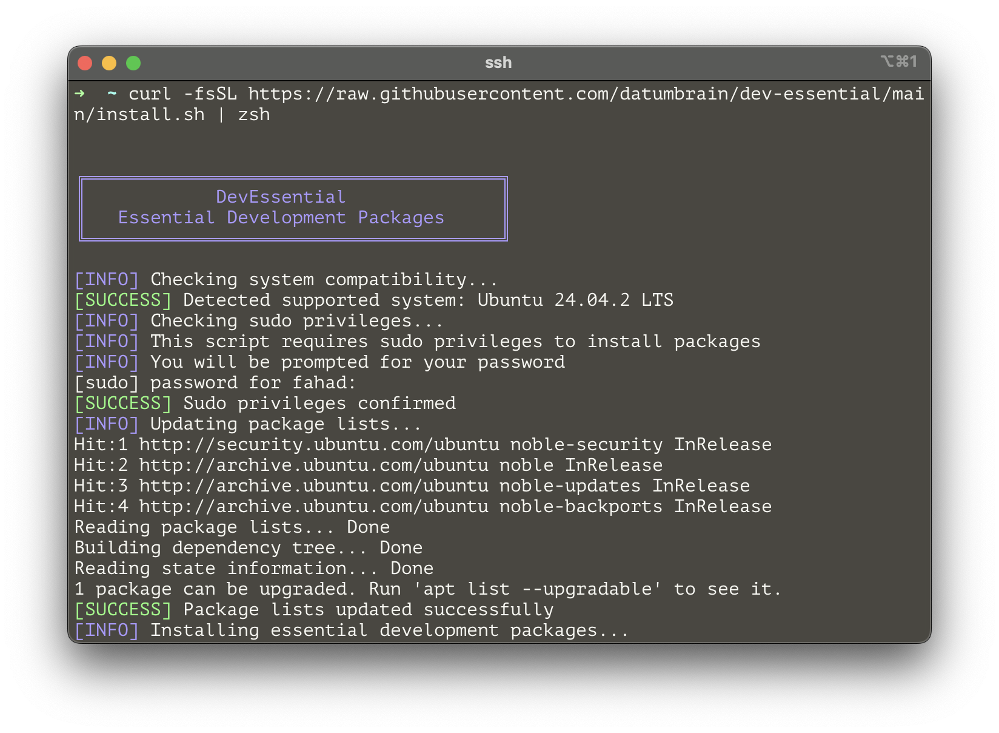

# DevEssential

🚀 Essential development packages installer for Ubuntu/Debian systems with Python development focus.

## Quick Install



Install all essential development packages with a single command:

```bash
curl -fsSL https://raw.githubusercontent.com/datumbrain/dev-essential/main/install.sh | bash
```

Or with zsh:

```bash
curl -fsSL https://raw.githubusercontent.com/datumbrain/dev-essential/main/install.sh | zsh
```

## What It Installs

DevEssential installs the essential build dependencies needed for:

- **Python development** with pyenv
- **Compiling from source**
- **Building native extensions**
- **SSL/TLS support**
- **Database connectivity**

### Package List

- `build-essential` - Essential compilation tools (gcc, make, etc.)
- `libssl-dev` - SSL/TLS support for secure connections
- `zlib1g-dev` - Compression library support
- `libbz2-dev` - bzip2 compression support
- `libreadline-dev` - Interactive command line editing
- `libsqlite3-dev` - SQLite database support
- `libffi-dev` - Foreign function interface for calling C libraries
- `libncursesw5-dev` - Terminal control library (wide character support)
- `xz-utils` - XZ compression utilities
- `tk-dev` - Tkinter GUI framework support
- `libxml2-dev` - XML parsing library
- `libxmlsec1-dev` - XML security library
- `liblzma-dev` - LZMA compression support
- `wget` - Web content retrieval tool
- `curl` - Data transfer tool
- `llvm` - Low Level Virtual Machine compiler infrastructure
- `git`

## Manual Installation

If you prefer to review the script first:

```bash
# Download the script
curl -fsSL https://raw.githubusercontent.com/datumbrain/dev-essential/main/install.sh -o install.sh

# Review the script
cat install.sh

# Make executable and run
chmod +x install.sh
./install.sh
```

## System Requirements

- Ubuntu 20.04+ or Debian-based distributions
- `sudo` privileges
- Internet connection

## Perfect For

- Setting up new development environments
- Preparing for pyenv Python installations
- Docker container development setups
- CI/CD pipeline preparation
- Fresh Ubuntu/Debian installations

## After Installation

Once DevEssential is installed, you can:

1. **Install pyenv:**

   ```bash
   curl https://pyenv.run | bash
   ```

2. **Install any Python version:**

   ```bash
   pyenv install 3.11.5
   pyenv global 3.11.5
   ```

## Contributing

Feel free to submit issues and enhancement requests!

## License

MIT License - see [LICENSE](LICENSE) file for details.
